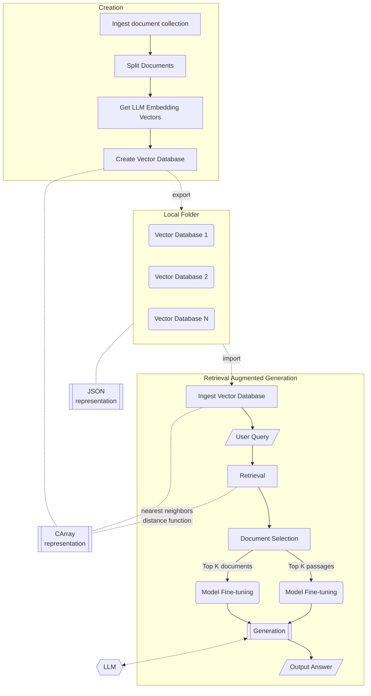

# LLM::RetrievalAugmentedGeneration

<!---  -->

Raku package for doing LLM Retrieval Augment Generation (RAG).

-----

## Motivation and general procedure

Assume we have a large (or largish) collection of (Markdown) documents and we want 
to interact with it as if a certain LLM model has been specially trained with that collection.

Here is one way to achieve this:

1. The "data wrangling problem" is the conversion of the a collection of documents into Markdown files, and then partitioning those files into text chunks.
   - There are several packages and functions that can do the conversion.
   - It is not trivial to partition texts into reasonable text chunks.
     - Certain text paragraphs might too big for certain LLMs to make embeddings for.
2. Each of the text chunks is "vectorized" via LLM embedding.
3. Then the vectors are put in a vector database or "just" into a "nearest neighbors" finding function object.
   - A large nearest neighbors finding object can be made with ["Math::Nearest"](https://raku.land/zef:antononcube/Math::Nearest), [AAp6]. 
   - Alternatively, a recommender system can be used like ["ML::StreamsBlendingRecommender"](https://github.com/antononcube/Raku-ML-StreamsBlendingRecommender), [AAp8]. 
4. When a user query is given:
   - The LLM embedding vector is being found.
   - The closest text chunk vectors are found.
5. The corresponding closest text chunks are given to the LLM to formulate a response to user's query.

------

## Workflow

Here is the Retrieval Augmented Generation (RAG) workflow we consider:

- The document collection is ingested.
- The documents are split into chunks of relevant sizes.
  - LLM embedding models have token limit that have to be respected.
  - It might be beneficial or desirable to split into "meaningful" chunks.
    - I.e. complete sentences or paragraphs.
- Large Language Model (LLM) embedding vectors are obtained for all chunks.
- A vector database is created with these embedding vectors and stored locally. Multiple local databases can be created.
- A relevant local database is imported for use.
- An input query is provided to a retrieval system.
- The retrieval system retrieves relevant documents based on the query.
- The top K documents are selected for further processing.
- The model is fine-tuned using the selected documents.
- The fine-tuned model generates an answer based on the query.
- The output answer is presented to the user.

### Component diagram

Here is a Mermaid-JS component diagram that shows the components of performing the Retrieval Augmented Generation (RAG) workflow:

In this diagram:

- Document collections are ingested, processed, and corresponding vector databases are made.
  - LLM embedding models are used for obtain the vectors.
- There are multiple local vector databases that are stored and maintained locally.
- A vector database from the local collection is selected and ingested.
- An input query provided by the user initiates the RAG workflow.
- The workflow then proceeds with:
   - retrieval
   - document selection
   - model fine-tuning
   - answer generation
   - presenting the final output

-----

## Implementation notes

- Since Vector DataBases (VDBs) are slow and "expensive" to compute, their stored in local directory.
  - By default `XDG_DATA_HOME` is used; for example, `~/.local/share/raku/LLM/SemanticSearchIndex`.
- LLM embeddings produce large, dense vectors, hence nearest neighbors finding algorithms like 
  [K-d Tree](https://en.wikipedia.org/wiki/K-d_tree#Degradation_in_performance_with_high-dimensional_data) do not apply.
  (Although, those algorithms perform well in low-dimensions.)
  - For example we can have 500 vectors each with dimension 1536.
- Hence, fast C-implementations of the common distance functions were made; see [AAp7].

-----

## References

### Packages

[AAp1] Anton Antonov,
[WWW::OpenAI Raku package](https://github.com/antononcube/Raku-WWW-OpenAI),
(2023),
[GitHub/antononcube](https://github.com/antononcube).

[AAp2] Anton Antonov,
[WWW::PaLM Raku package](https://github.com/antononcube/Raku-WWW-PaLM),
(2023),
[GitHub/antononcube](https://github.com/antononcube).

[AAp3] Anton Antonov,
[LLM::Functions Raku package](https://github.com/antononcube/Raku-LLM-Functions),
(2023-2024),
[GitHub/antononcube](https://github.com/antononcube).

[AAp4] Anton Antonov,
[LLM::Prompts Raku package](https://github.com/antononcube/Raku-LLM-Prompts),
(2023-2024),
[GitHub/antononcube](https://github.com/antononcube).

[AAp5] Anton Antonov,
[ML::FindTextualAnswer Raku package](https://github.com/antononcube/Raku-ML-FindTextualAnswer),
(2023-2024),
[GitHub/antononcube](https://github.com/antononcube).

[AAp6] Anton Antonov,
[Math::Nearest Raku package](https://github.com/antononcube/Raku-Math-Nearest),
(2024),
[GitHub/antononcube](https://github.com/antononcube).

[AAp7] Anton Antonov,
[Math::DistanceFunctions::Native Raku package](https://github.com/antononcube/Raku-Math-DistanceFunctions-Native),
(2024),
[GitHub/antononcube](https://github.com/antononcube).

[AAp8] Anton Antonov,
[ML::StreamsBlendingRecommender Raku package](https://github.com/antononcube/Raku-ML-StreamsBlendingRecommender),
(2021-2023),
[GitHub/antononcube](https://github.com/antononcube).
